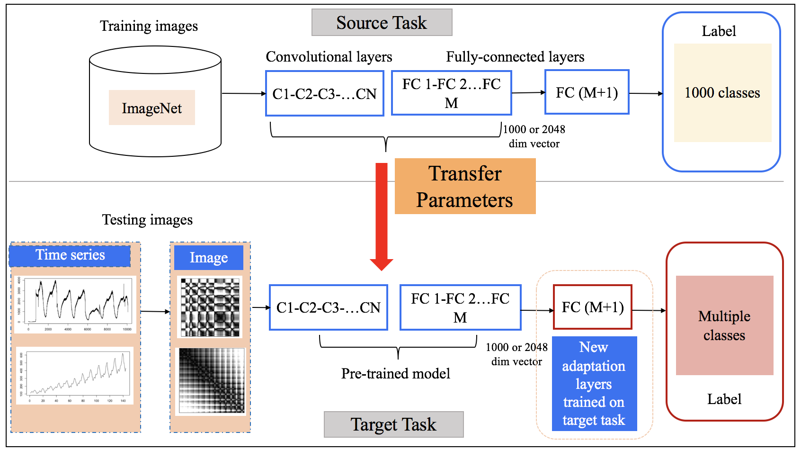

Image based time series forecasting
================
Xixi Li
2020-05-11

This page introduces how to use our code for image based time series forecasting. The code is divided 2 parts:

- feature extraction with sift or pretrained CNN
- model combination based on extracted feature

We completed feature extraction with python because python supports image processing well, while for model combination, we choosed R because R supports statistical forecasting methods very well.


Authorship
==========

-   Xixi Li
-   Yanfei Kang
-   Feng Li

Dependency packages
========

This code depends some package with specific versions. Before using it, install these packages first.

We use python3.6 for this project. For feature extraction, please install 

- pip install tensorflow==1.2.1 
- pip install scipy==1.2.1
- pip install opencv-contrib-python==3.4.2.17
- conda install opencv-contrib-python==3.4.2.17 

For model combination, please install `xgboost` first as follows

- devtools::install_github("pmontman/customxgboost")

The structure of the project
========


Usage
========

1.feature extraction
================

1.1 feature extraction with sift
-----------------
In the folder `feature_extraction/feature_extraction_with_sift`, the function `image_based_batch_ts_feature_extraction_with_sift()` in the file `compute_features_sift.py` is used to compute features of time series image.

Parameters explaination for this function `image_based_batch_ts_feature_extraction_with_sift(file_path_of_ts,file_path_of_feature,num_cores)`:

- `file_path_of_ts`: the file path of your time series data and it is saved in the format of csv. You can dowoload M4 dataset from [here](https://www.m4.unic.ac.cy/wp-content/uploads/2017/12/M4DataSet.zip). Then, zip it and put it in `feature_extraction/ts-data/M4/MM4DataSet/`.
- `file_path_of_feature`: the file path where you want to save the extracted feature. In this project, we save the extracted features in `feature_extraction/feature_extraction_with_sift/sift-features`.
- `num_cores ` : number of cores that you want to use when parallel computing.

We show an exmple:

    ```python
    file_path_of_ts='../ts-data/M4/M4DataSet/Monthly-train.csv'
    file_path_of_feature='sift-features/M4/M4-monthly-feature-sift.csv'
    num_cores=4
    image_based_batch_ts_feature_extraction_with_sift(file_path_of_ts,file_path_of_feature,num_cores)
    ```
    The ouput is features of time series images and its shape is n*4200, where n is the number of time series.
1.2 feature extraction with pretrained-CNN
-----------------
In the folder `feature_extraction/feature_extraction_with_pretrained_CNN`, the function `image_based_batch_ts_feature_extraction_with_sift()` in the file `compute_features_cnn.py` is used to compute features of time series image.

Parameters explaination for function `image_based_batch_ts_feature_extraction_with_cnn(file_path_of_ts,file_path_of_feature,cnn_model_name,file_path_of_pretrained_model)`:

- `file_path_of_ts`: the file path of your time series data and it is saved in the format of csv. You can dowoload M4 dataset from [here](https://www.m4.unic.ac.cy/wp-content/uploads/2017/12/M4DataSet.zip). Then, zip it and put it in `feature_extraction/ts-data/M4/MM4DataSet/`.
- `file_path_of_feature`: the file path where you want to save the extracted feature. In this project, we save the extracted features in `feature_extraction/feature_extraction_with_pretrained_CNN/cnn-features`.
- `cnn_model_name`: which pretrained CNN models you want to use, options include `inception_v1 `,`resnet_v1 _101`,`resnet_v1_50` and `vgg_19`.
- `file_path_of_pretrained_model`: file path of pretrained models. You can download all the pretrained models in the following content.

We show an exmple:

    ```python
    file_path_of_ts='../ts-data/M4/M4DataSet/Monthly-train.csv'
    file_path_of_feature='cnn-features/M4/M4-monthly-feature-inceptionV1.csv'
    cnn_model_name='inception_v1'
    file_path_of_pretrained_model='pretrained-models/inception_v1.ckpt'
    image_based_batch_ts_feature_extraction_with_cnn(file_path_of_ts,file_path_of_feature,cnn_model_name,file_path_of_pretrained_model)
The ouput is features of time series images and its shape is n*m, where n is the number of time series and m is the dimension of the features.

- Dimension of the output of the pretrained Inception-v1 model: 1024.
- Dimension of the output of the pretrained ResNet-v1-101 model: 2048.
- Dimension of the output of the pretrained ResNet-v1-50 model: 2048.
- Dimension of the output of the pretrained VGG model: 1000.

pretrained-CNN models
-----------------

You can download all models [here](https://drive.google.com/file/d/13pyno-mdbazKs0o4N_Pk8ArDtk1RcE-U/view?usp=sharing).
Otherwise links for individual models can be found below.

These CNNs have been trained on the [ILSVRC-2012-CLS](http://www.image-net.org/challenges/LSVRC/2012/)
image classification dataset.

In the table below, we list each model, the corresponding
TensorFlow model file, the link to the model checkpoint。

Model | TF-Slim File | Checkpoint 
:----:|:------------:|:----------:|
[Inception V1](http://arxiv.org/abs/1409.4842v1)|[Code](https://github.com/tensorflow/models/blob/master/research/slim/nets/inception_v1.py)|[inception_v1_2016_08_28.tar.gz](http://download.tensorflow.org/models/inception_v1_2016_08_28.tar.gz)
[ResNet V1 50](https://arxiv.org/abs/1512.03385)|[Code](https://github.com/tensorflow/models/blob/master/research/slim/nets/resnet_v1.py)|[resnet_v1_50_2016_08_28.tar.gz](http://download.tensorflow.org/models/resnet_v1_50_2016_08_28.tar.gz)
[ResNet V1 101](https://arxiv.org/abs/1512.03385)|[Code](https://github.com/tensorflow/models/blob/master/research/slim/nets/resnet_v1.py)|[resnet_v1_101_2016_08_28.tar.gz](http://download.tensorflow.org/models/resnet_v1_101_2016_08_28.tar.gz)
[VGG 19](http://arxiv.org/abs/1409.1556.pdf)|[Code](https://github.com/tensorflow/models/blob/master/research/slim/nets/vgg.py)|[vgg_19_2016_08_28.tar.gz](http://download.tensorflow.org/models/vgg_19_2016_08_28.tar.gz)

2.model combination
================
Based on the extracted features above, we can do model combination.

In the folder `model_combination/R`, the main function `image.based.model.combination()` in the file `model.comb.main.R` is used to do model combination.

Here, I will brifely introduce the function of other `.R` files.


- `forec_methods_list.R`: it is used to compute the forecasts of 9 candidate methods.
- `process_dataset.R`: it is used to compute the accuracy of forecasting methods.
- `combination_ensemble.R`: it is used to define the custom loss function of `xgboost`.
- `ensemble_classifier.R': it is used to train and test the `xgboost` model.
-  `hyperparam.R`: hyperparameters optimization for `xgboost`.
-  `tourism.benchmarks.R`: it is used to compute forecasts of the top methods in toursim competition.


Parameters explaination for this function 
 

``` r
  image.based.model.combination(
                                #1.which data you'd like to use for training the model, 
                                #you can select 'yearly','quarterly','monthly','weekly','daily' and so on
                                data.type.of.training.data, 
                                
                                #2.which data you'd like to use for testing the model, 
                                #you can select 'yearly','quarterly','monthly','weekly','daily' and so on
                                data.type.of.testing.data,
                                
                                #3.you can choose M4 or tourism
                                training.dataset,
                                
                                #4.you can choose M4 or tourism
                                testing.dataset,
                                
                                #feature type includes sift, inception_v1, resnet101, resnet50 and vgg19
                                feature.type,
                                
                                #5.file path of your training data features, in 'csv' format, shape:n*f, 
                                #where n is the number of time series and f is the dimension of features
                                file.path.of.training.data.features
                                
                                #6.file path of your testing data features, in 'csv' format, shape:n*f,
                                #where n is the number of time series and f is the dimension of features 
                                file.path.of.testing.data.features,
                                
                                #7.file path of the forecasts of 9 methods of training data, in 'rda' 
                                #format, we provide an example in the project
                                file.path.of.training.data.prediction.value,
                                
                                #8.file path of the forecasts of 9 methods of testing data, in 'rda' format,
                                we provide an example in the project
                                file.path.of.testing.data.prediction.value)
```

We show an example that get forecasts of Tourism monthly data with M4 monthly data as training data:

    ```r
    data.type.of.training.data='Monthly'
    data.type.of.testing.data='MONTHLY'
    training.dataset=M4
    testing.dataset=tourism
    feature.type='resnet50'
    file.path.of.training.data.features='C:/xixi/feature_extraction/cnn/cnn-features/M4/Monthly-train-feature-resnet_v1_50.csv'
    file.path.of.testing.data.features='C:/xixi/feature_extraction/cnn/cnn-features/Tourism/tourism-monthly-train-feature-resnet_v1_50.csv'
    file.path.of.training.data.prediction.value='./forecasts/M4/Monthly_ff.rda'
    file.path.of.testing.data.prediction.value='./forecasts/Tourism/MONTHLY_ff.rda'
    image.based.model.combination(data.type.of.training.data,
                              data.type.of.testing.data,
                              training.dataset,
                              testing.dataset,
                              feature.type,
                              file.path.of.training.data.features,
                              file.path.of.testing.data.features,
                              file.path.of.training.data.prediction.value,
                              file.path.of.testing.data.prediction.value)
    ```
Then, we can get the forecasting accuracy of the combination method on the targeted dataset.


References
----------

- Li, Xixi, Yanfei Kang, and Feng Li. "Forecasting with time series imaging."(2019). [Working paper on arXiv](https://arxiv.org/abs/1904.08064).
